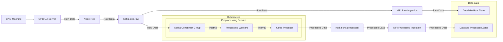
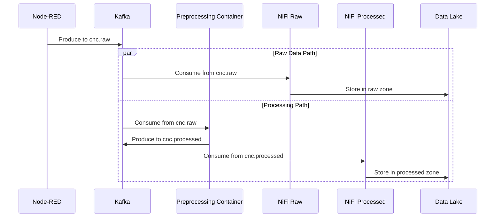

# CNC Machine Monitoring Data Pipeline

## Architecture Overview



## Preprocessing Service Architecture

### Kubernetes Deployment

```yaml
# High-level deployment structure
deployment:
  name: cnc-preprocessing-service
  components:
    - Statefulset for processing workers
    - ConfigMaps for processing parameters
    - Secrets for Kafka credentials
    - HorizontalPodAutoscaler for scaling
    - Service for monitoring/metrics
    - PodDisruptionBudget for availability

scaling:
  min_replicas: 2
  max_replicas: 10
  metrics:
    - type: kafka_lag
    - type: cpu_utilization
    - type: memory_usage
```

### Processing Service Components

1. **Stream Processing Engine**:
   - Kafka Streams application for continuous data processing
   - Built-in fault tolerance and exactly-once processing
   - Automatic partition management and scaling
   - State stores for maintaining processing context

2. **Processing Pipeline Stages**:
   ```mermaid
   graph LR
       A[Kafka Consumer] -->|Stream| B[Data Validation]
       B -->|Valid Data| C[Feature Extraction]
       C --> D[Quality Analysis]
       D --> E[Dimensionality Reduction]
       E -->|Processed Data| F[Kafka Producer]
       B -->|Invalid Data| G[Dead Letter Queue]
   ```

3. **Resource Management**:
   - CPU: 2-4 cores per pod
   - Memory: 4-8GB per pod
   - Temporary storage for processing
   - Configurable via Kubernetes resources

4. **Data Flow Control**:
   - Back-pressure handling
   - Rate limiting
   - Batch size optimization
   - Error handling and retry policies

### Failure Handling

```yaml
failure_modes:
  - kafka_connectivity:
      retry_policy: exponential_backoff
      max_retries: 5
      
  - processing_errors:
      strategy: dead_letter_queue
      alert_threshold: 1000 messages
      
  - resource_exhaustion:
      action: scale_out
      cool_down_period: 5m
```

### Performance Considerations

1. **Scalability**:
   - Horizontal scaling based on Kafka lag
   - Partition-aware processing
   - Stateful processing with Kafka Streams

2. **Efficiency**:
   - Batch processing optimization
   - Memory-efficient operations
   - Resource utilization monitoring

3. **Reliability**:
   - Exactly-once processing semantics
   - Automatic recovery from failures
   - Data consistency guarantees

## Communication Pattern



### Preprocessing Container Technology Stack

```yaml
# Technology Stack Overview
Core:
  - Python 3.9+
  - FastAPI (Health Checks)
  - Kafka-Python (Kafka Client)
  - Redis (State Management)

Processing:
  - NumPy (Numerical Processing)
  - SciPy (Signal Processing)
  - scikit-learn (ML Features)
  - pandas (Data Manipulation)

Monitoring:
  - Prometheus (Metrics)
  - OpenTelemetry (Tracing)
```

### Implementation Example

```python
# preprocessing_service/main.py
from kafka import KafkaConsumer, KafkaProducer
from fastapi import FastAPI
import redis
import json
import numpy as np
from typing import Dict
from concurrent.futures import ThreadPoolExecutor

app = FastAPI()  # For health checks only

# Redis for state management
redis_client = redis.Redis(host='redis', port=6379, db=0)

# Kafka configuration
KAFKA_BOOTSTRAP_SERVERS = ['kafka:9092']
KAFKA_RAW_TOPIC = 'cnc.raw'
KAFKA_PROCESSED_TOPIC = 'cnc.processed'

class PreprocessingService:
    def __init__(self):
        self.consumer = KafkaConsumer(
            KAFKA_RAW_TOPIC,
            bootstrap_servers=KAFKA_BOOTSTRAP_SERVERS,
            group_id='preprocessing-service',
            auto_offset_reset='latest',
            enable_auto_commit=False,
            value_deserializer=lambda x: json.loads(x.decode('utf-8'))
        )
        
        self.producer = KafkaProducer(
            bootstrap_servers=KAFKA_BOOTSTRAP_SERVERS,
            value_serializer=lambda x: json.dumps(x).encode('utf-8')
        )
        
        # Thread pool for parallel processing
        self.executor = ThreadPoolExecutor(max_workers=4)
        
    async def process_data(self, data: Dict) -> Dict:
        """Process a single data record"""
        try:
            # 1. Outlier Detection
            if not self.is_valid_data(data):
                return self.handle_invalid_data(data)
            
            # 2. Feature Extraction
            features = self.extract_features(data)
            
            # 3. Dimensionality Reduction
            reduced_features = self.reduce_dimensions(features)
            
            # 4. Quality Validation
            quality_metrics = self.validate_quality(data, features)
            
            return {
                'raw_data': data,
                'features': features,
                'reduced_features': reduced_features,
                'quality_metrics': quality_metrics,
                'processing_metadata': {
                    'timestamp': datetime.now().isoformat(),
                    'version': '1.0'
                }
            }
        except Exception as e:
            return self.handle_processing_error(data, str(e))

    def start(self):
        """Start consuming messages"""
        try:
            for message in self.consumer:
                # Process in thread pool
                self.executor.submit(self.handle_message, message)
                
        except Exception as e:
            logger.error(f"Consumer error: {str(e)}")
            # Implement retry/recovery logic
            
    def handle_message(self, message):
        try:
            # Process the data
            result = await self.process_data(message.value)
            
            # Track processing state
            await self.track_processing_state(
                message.value.get('id'),
                'completed'
            )
            
            # Send to processed topic
            self.producer.send(
                KAFKA_PROCESSED_TOPIC,
                value=result,
                key=str(message.value.get('id')).encode()
            )
            
            # Commit offset only after successful processing
            self.consumer.commit()
            
        except Exception as e:
            logger.error(f"Processing error: {str(e)}")
            # Handle error (dead letter queue, retry, etc.)
            self.handle_processing_failure(message)

    async def track_processing_state(self, data_id: str, state: str):
        """Track processing state in Redis"""
        redis_client.hset(
            f"processing:{data_id}",
            mapping={
                'state': state,
                'timestamp': datetime.now().isoformat(),
                'retries': redis_client.hincrby(f"processing:{data_id}", 'retries', 1)
            }
        )

# Node-RED Flow Configuration
```javascript
{
    "name": "CNC Data Pipeline Flow",
    "nodes": [
        {
            "id": "opc-ua-in",
            "type": "opc-ua",
            "broker": "opc.tcp://0.0.0.0:4840/",
            "datatype": "json"
        },
        {
            "id": "kafka-raw-out",
            "type": "kafka-producer",
            "topic": "cnc.raw",
            "brokers": "kafka:9092"
        }
    ]
}
```

### Container Configuration

```yaml
# docker-compose.yml
version: '3.8'
services:
  preprocessing-service:
    build: ./preprocessing
    environment:
      - KAFKA_BOOTSTRAP_SERVERS=kafka:9092
      - REDIS_HOST=redis
      - REDIS_PORT=6379
      - PROCESSING_THREADS=4
      - BATCH_SIZE=100
    depends_on:
      - kafka
      - redis
    networks:
      - edge-network

  redis:
    image: redis:6
    ports:
      - "6379:6379"
    networks:
      - edge-network

  # Kafka and Zookeeper configurations from existing setup
```

### Kafka Topics Structure
```yaml
topics:
  - name: cnc.raw
    partitions: 3
    replication-factor: 2
    configs:
      retention.ms: 86400000  # 24 hours
      
  - name: cnc.processed
    partitions: 3
    replication-factor: 2
    configs:
      retention.ms: 86400000  # 24 hours
      
  - name: cnc.raw.retry
    partitions: 1
    replication-factor: 2
    configs:
      retention.ms: 259200000  # 72 hours
      
  - name: cnc.raw.dlq
    partitions: 1
    replication-factor: 2
    configs:
      retention.ms: 604800000  # 7 days
```

### Error Handling & Recovery

```python
def handle_processing_failure(self, message):
    """Handle failed message processing"""
    try:
        # Get retry count
        retries = int(redis_client.hget(f"processing:{message.value.get('id')}", 'retries') or 0)
        
        if retries < MAX_RETRIES:
            # Requeue message
            self.producer.send('cnc.raw.retry', value=message.value)
        else:
            # Send to dead letter queue
            self.producer.send('cnc.raw.dlq', value={
                'original_message': message.value,
                'error_count': retries,
                'last_error_time': datetime.now().isoformat()
            })
    except Exception as e:
        logger.error(f"Error handling failure: {str(e)}")
```

## Data Flow Details

1. **OPC UA → Node-RED**
   - Raw vibration data ingestion

2. **Node-RED → Kafka (cnc.raw)**
   - Async message production to Kafka topic
   - Raw data as message payload

3. **Preprocessing Container Processing**
   - Outlier detection
   - Feature extraction
   - Dimensionality reduction
   - Quality validation

4. **Preprocessing Container → Kafka (cnc.processed)**
   - Processed data publication
   - Quality metrics included

5. **NiFi → Data Lake**
   - Raw data ingestion from cnc.raw topic
   - Processed data ingestion from cnc.processed topic
   - Data partitioning and organization for both streams

## Data Structure Evolution Through Pipeline

### 1. OPC UA Server Output (Raw Data)
```json
{
  "VibrationX": -9,
  "VibrationY": -19,
  "VibrationZ": -1344,
  "VibrationXYZ": [-9, -19, -1344],
  "ServerTimestamp": "2025-06-03T06:45:41.532Z",
  "SourceTimestamp": "2025-06-03T06:45:41.532Z",
  "StatusCode": "Good"
}
```

### 2. Node-Red Preprocessing Steps

#### 1. Outlier Detection Node (First)
```javascript
// Node-RED Function Node - Must run first
msg.payload = {
    raw_data: msg.payload,
    outlier_check: {
        is_valid: checkOutliers(msg.payload.VibrationXYZ),
        outlier_score: calculateOutlierScore(msg.payload.VibrationXYZ)
    }
};
// Only proceed if data is valid
if (!msg.payload.outlier_check.is_valid) {
    return null; // Stop processing invalid data
}
return msg;
```

#### 2. Feature Extraction Node (Second)
```javascript
// Node-RED Function Node
const vibData = msg.payload.raw_data.VibrationXYZ;
msg.payload = {
    ...msg.payload,
    features: {
        time_domain: {
            rms: calculateRMS(vibData),
            peak_to_peak: calculatePeakToPeak(vibData),
            crest_factor: calculateCrestFactor(vibData)
        },
        frequency_domain: {
            dominant_freq: calculateDominantFrequency(vibData),
            spectral_energy: calculateSpectralEnergy(vibData)
        }
    }
};
return msg;
```

#### 3. Dimensionality Reduction Node (Third)
```javascript
// Node-RED Function Node
const features = [...msg.payload.features.time_domain, ...msg.payload.features.frequency_domain];
msg.payload = {
    ...msg.payload,
    reduced_features: {
        principal_components: applyPCA(features)
    }
};
return msg;
```

#### 4. Quality Validation Node (Last)
```javascript
// Node-RED Function Node
msg.payload = {
    ...msg.payload,
    quality_metrics: {
        data_quality_score: calculateQualityScore(msg.payload),
        completeness: checkCompleteness(msg.payload),
        consistency: checkConsistency(msg.payload),
        processing_version: "1.0",
        processing_timestamp: new Date().toISOString()
    }
};
return msg;
```

### 3. Final Data Structure (To Kafka)
```json
{
  "raw_data": {
    "VibrationX": -9,
    "VibrationY": -19,
    "VibrationZ": -1344,
    "VibrationXYZ": [-9, -19, -1344],
    "ServerTimestamp": "2025-06-03T06:45:41.532Z",
    "SourceTimestamp": "2025-06-03T06:45:41.532Z",
    "StatusCode": "Good"
  },
  "outlier_check": {
    "is_valid": true,
    "outlier_score": 0.05
  },
  "features": {
    "time_domain": {
      "rms": 1344.12,
      "peak_to_peak": 1335.0,
      "crest_factor": 0.95
    },
    "frequency_domain": {
      "dominant_freq": 50.0,
      "spectral_energy": 123.45
    }
  },
  "reduced_features": {
    "principal_components": [0.856, 0.234, 0.123]
  },
  "quality_metrics": {
    "data_quality_score": 0.98,
    "completeness": 1.0,
    "consistency": true,
    "processing_version": "1.0",
    "processing_timestamp": "2025-06-03T06:45:41.635Z"
  }
}
```

## Data Lake Structure

```plaintext
data_lake/
├── raw_zone/
│   └── cnc_data/
│       ├── machine_M01/
│       │   ├── 2024/
│       │   │   └── 03/
│       │   │       └── raw_data.parquet
│       │   └── metadata.json
│       └── machine_M02/
│           └── ...
│
├── processed_zone/
│   └── cnc_data/
│       ├── machine_M01/
│       │   ├── 2024/
│       │   │   └── 03/
│       │   │       ├── features.parquet
│       │   │       ├── quality_metrics.parquet
│       │   │       └── processing_metadata.json
│       │   └── model_ready/
│       │       └── training_data.parquet
│       └── machine_M02/
│           └── ...
│
└── metadata/
    ├── raw/
    │   └── ingestion_logs.json
    └── processed/
        └── processing_logs.json
```

## Component Configuration

### 1. OPC UA Server
- Maintains original configuration from Bosch implementation
- Sampling Rate: 2 kHz
- No modifications to data structure at this stage

### 2. Node-Red Flow
```json
{
    "name": "CNC Data Pipeline",
    "nodes": [
        {
            "type": "opc-ua-client",
            "name": "CNC Machine Connection",
            "endpoint": "opc.tcp://machine:4840",
            "dataItems": [
                "ns=2;s=VibrationX",
                "ns=2;s=VibrationY",
                "ns=2;s=VibrationZ"
            ]
        },
        {
            "type": "kafka-broker",
            "name": "Kafka Producer",
            "broker": "kafka:9092",
            "topic": "cnc.raw"
        }
    ],
    "settings": {
        "samplingInterval": 100,
        "publishingInterval": 500,
        "queueSize": 1000,
        "kafkaBatchSize": 100
    }
}
```

### 3. Kafka Topics
```yaml
topics:
  - name: cnc-processed-data
    partitions: 3
    replication-factor: 2
    configs:
      retention.ms: 604800000  # 7 days
```

### 4. NiFi Flow Configuration
- Consumes from Kafka topic 'cnc-processed-data'
- Routes data based on quality metrics(if any)
- Stores raw data in raw_zone regardless of quality

## Benefits of This Approach

1. **Efficient Processing**
   - Early outlier filtering saves resources
   - Progressive feature enhancement
   - Optimized storage through dimensionality reduction

2. **ML-Ready Data**
   - Features pre-extracted and validated
   - Dimensionality already reduced
   - Quality metrics available

3. **Data Lineage**
   - Complete processing history
   - Raw data preserved
   - Quality metrics at each step

4. **Storage Optimization**
   - Partitioned by quality
   - Efficient parquet format
   - Separate raw and processed zones

## Getting Started
1. Deploy OPC UA server (from opcua-server)
2. Import Node-Red preprocessing flow
3. Configure Kafka topics
4. Set up NiFi processors with routing rules
5. Create data lake folder structure

## References
- Bosch CNC Dataset Specifications
- OPC UA Protocol Standards
- Node-RED Documentation
- Apache Kafka Documentation
- Apache NiFi Documentation 